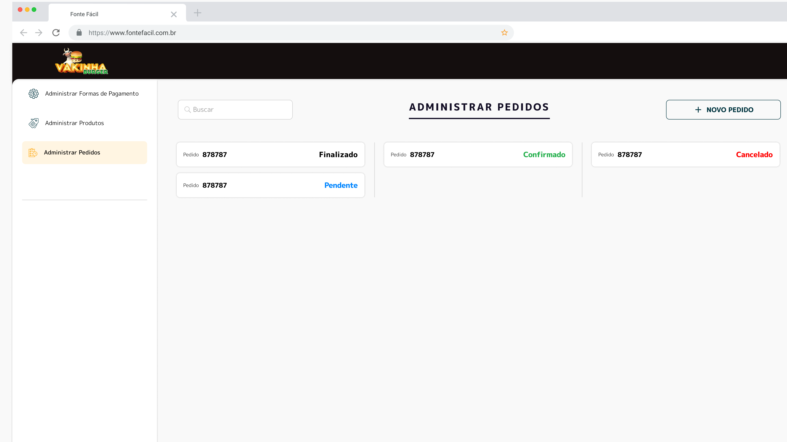

# admfood

Projeto flutter para adminitração de balcão app de delivery.

# Getting Started

&nbsp;Este projeto foi realizado durante o evento da semana dart week, ministrada pelo Rodrigo Rhaman. O obejtivo do projeto era criar uma área administrativa para empresas no segmento de culinária, "lanchonentes", e etc. Dessa vez em de fazer uma versão mobile, foi utiilizado pela primeira vez o flutter web, uma novidade no evento, o qual eu gostei bastante. Sendo assim fica bem mais fácil e agradável trabalhar no computador com uma tela maior, e obter um melhor controle. O app de administração é uma continuação do evento anterior o qual foi um app de delivery.

## Principais tecnologias utlizadas

<ul>
  <li>Flutter Web</li>
  <li>Package flutter_modular</li>
  <li>Packge flutter_mobx</li>
</ul>

# Desgin do app

  
  
  
  
  

